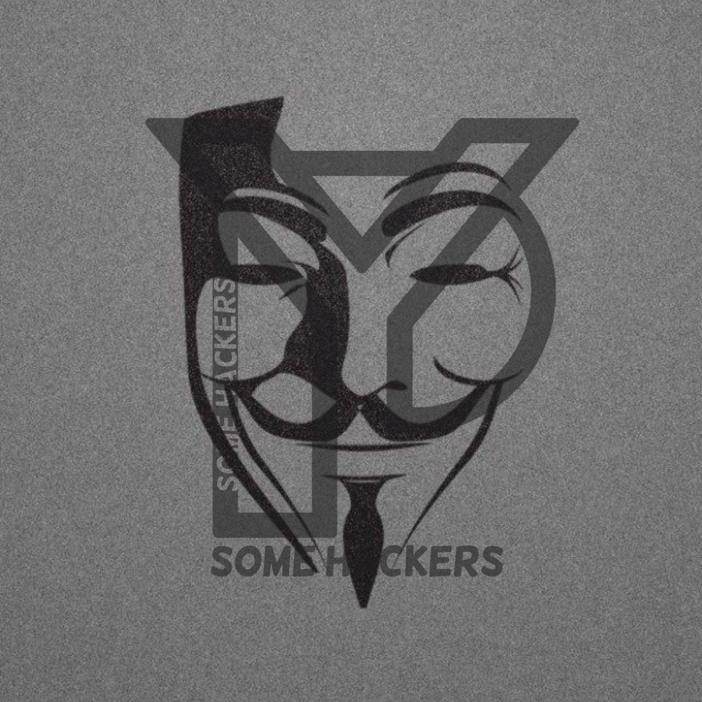
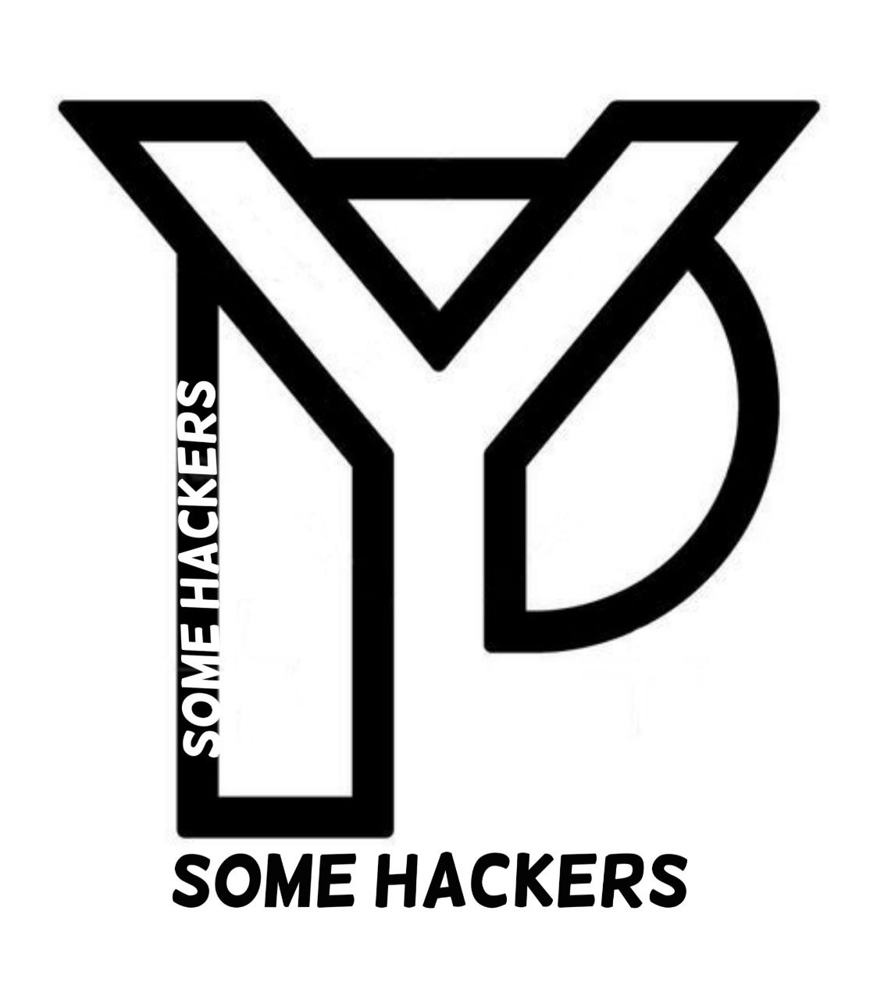

<h1 align="center">Hi 👋, I'm Ahmed AbuObaida</h1>
<h3 align="center">🛡️ IT & Cybersecurity Student | Linux & Automation Enthusiast 🇸🇩</h3>

  

---

### 🏆 GitHub Trophies

  

---

### 🎨 Showcase & Highlights

  
  
  
  

---

### 🛠️ Tech Stack & Skills

  <!-- Core Languages -->
  
  
  
  
  
  

<b>📂 إظهار باقي التقنيات والأدوات</b>

 

  
  
  
  
  
  

---

### 📊 GitHub Stats

  
  

---

### 🌐 Connect with me

  
  &nbsp;&nbsp;
  

